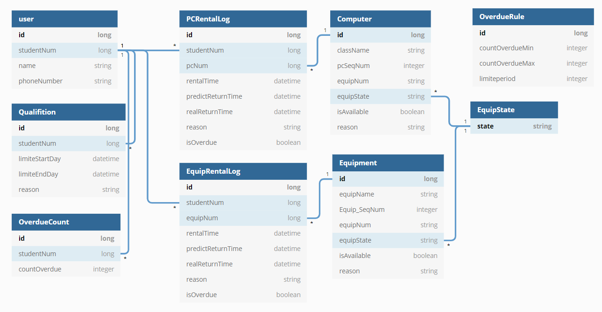

# 학과 기자재 관리 페이지 제작

- 학교 기자재 및 실습실 빌리는 것을 웹상에서 체크하고 빌릴수 있도록 하는 사이트

## 기능
1. 로그인, 회원가입, 로그아웃

2. 실습실이랑 기자재 관리자와 사용자 사이트 구분체크

3. 기자재 관리
     - 상태(사용가능/사용불가/수리중)

4. 실습실 컴퓨터 관리
    - 상태(사용가능/사용불가/수리중)

5. 문제 해결을 위한 게시판
    - 기자재의 이상이나 문제 등 올리는 게시판

## 사용 기술
__1. Spring boot 2.2.6 사용__ 
    - yml, gradle

__2. H2 DB__ 

__3. Jpa__ 
    - interface를 통한 기본적인 CRUD 사용
    - `@Query`, `@Modifying` annotation을 사용하여 커스텀 쿼리 추가
    - `@EntityListeners` annotation을 사용하여 필드 생성, 수정 TimeStamp 추가
    - Table 제약조건 추가
        - `@Column`, `@Id`, `@GenteratedValue`
    - Table 구조 추가
        - `@ManyToOne`, `@JoinColumn`

__4. Lombok__ 
    - Entity Class에 `AccessLevel` 설정
    - Entity Class에는 `@NoArgsConstructer` `@Entity`, `@Builder` 사용
    - Controller Class에는 `@AllArgsConstructer` 사용
    - DTO Class에는 `@Getter`, `@Builder` 사용

__5. Validation__ 
     - DTO 유효성 검사 추가

__6. Spring boot Security__ 
    - 로그인, 로그아웃, 회원가입 기능
    - 로그인 후 세션을 사용하여 유저 관리
    - 세션에는 사용자 정보 저장 후 사용

__7. Thymeleaf__ 
    - 뷰는 서버사이드를 사용
    - `thymeleaf-layout-dialect`를 사용하여 layout를 나누어 관리

__8. ModelMapper__ 
    - 쿼리를 통해 반환된 Entity List를 Dto로 변환 시에 ModelMapper를 이용하여 형변환, 전부 변경하지 않음

__9. JUnit 5.0__ 
    - 테스트는 서비스단에서 테스트

__10. @ControllerAdvice__ 
    - 에러 처리는 하나의 클래스에서 처리하였으며 `ExceptionResponse.class`를 만들어 구조화된 에러처리

__11. RestController__ 
   -  `RestResponse<T>.class`를 만들어 구조화된 방식으로 Json 리턴

## DB 구조
   
